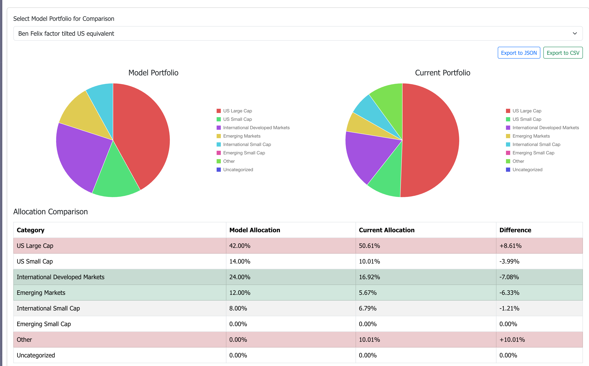

# Portfolio Rebalancer

A web application to help track and rebalance investment portfolios according to target allocation models.

## Features

- **Model Portfolio Management**: Create and save model portfolios with target asset allocations
- **Portfolio Tracking**: Add investment accounts and positions with real-time price updates
- **Asset Classification**: Categorize holdings by investment classes (US Large Cap, International, etc.)
- **Allocation Visualization**: View current allocation with interactive pie charts
- **Rebalancing Tools**: Compare current allocation with target models and get rebalancing suggestions
- **Data Export**: Export portfolio data and rebalancing recommendations to JSON or CSV
- **Data Persistence**: Save portfolio data locally with backup and restore capabilities in both web and desktop versions

## Screenshot


*Portfolio comparison view showing allocation differences between model and current portfolios*

## Getting Started

### Prerequisites

- Node.js (v14.0.0 or higher)
- npm (v6.0.0 or higher)

### Installation

1. Clone the repository:
   ```
   git clone https://github.com/yourusername/portfolio-rebalancer.git
   cd portfolio-rebalancer
   ```

2. Install dependencies:
   ```
   npm install
   ```

3. Start the development server:
   ```
   npm start
   ```

4. Open [http://localhost:3000](http://localhost:3000) in your browser to use the application.

### Desktop App (Optional)

For enhanced features like automatic file-based data persistence:

1. Run the desktop application:
   ```
   npm run electron-dev
   ```

2. Build desktop apps for distribution:
   ```
   npm run package
   ```

## Usage Guide

### Setting Up Model Portfolios

1. Navigate to the "Model Portfolios" tab
2. Click "Add New Model Portfolio"
3. Enter a name for your portfolio
4. Add stocks with their target percentages and categories
5. Click "Save Portfolio"

### Adding Your Accounts

1. Navigate to the "Current Portfolio" tab
2. Click "Add Account"
3. Enter an account name (e.g., "401k", "Roth IRA")
4. Add positions by clicking "Add Position" 
5. Enter the symbol, number of shares, and category for each position

### Price Updates

There are two ways to update prices:

#### Manual Price Entry
1. Click "Edit Prices" in the Current Portfolio tab
2. Enter prices for each stock in your portfolio
3. Click "Save Prices"

#### Real-time Price Sync with Marketstack API
1. Click "Sync Prices" in the Current Portfolio tab
2. If prompted, enter your Marketstack API key
   - You can get a free API key by signing up at [marketstack.com](https://marketstack.com)
   - Free tier allows up to 1000 API requests per month
3. Wait for prices to sync (this may take a moment for large portfolios)

To configure or update your API key:
1. Click "API Settings" button in the Current Portfolio tab
2. Enter your Marketstack API key
3. Click "Save API Key"

### Portfolio Rebalancing

1. Navigate to the "Portfolio Comparison" tab
2. Select a model portfolio to compare with your current holdings
3. View the side-by-side comparison of target vs. actual allocation
4. Review rebalancing suggestions
5. Click "Show Specific Rebalancing Suggestions" for detailed buy/sell recommendations
6. Export recommendations to CSV or JSON for record-keeping

### Managing Categories

1. Navigate to the "Categories" tab
2. Add, edit, or delete asset categories as needed
3. The default categories include:
   - US Large Cap
   - US Small Cap
   - International Developed Markets
   - Emerging Markets
   - International Small Cap
   - Emerging Small Cap
   - Other

### Data Persistence

#### In Web Browser
- **Local Storage**: All data is automatically saved to your browser's localStorage.
- **Manual Backup**: Click "Backup Data" to download a JSON file with all your portfolio data.
- **Manual Restore**: Click "Restore Data" then "Import From File" to upload a previously created backup file.
- **Limitations**: Data is tied to your browser and may be lost if you clear browser data or switch browsers.

#### In Desktop App
When using the desktop app, data is automatically saved to files on your computer:

1. **Automatic Backups**: Your portfolio data is automatically saved to a file in your application data directory.
2. **Manual Backups**: Click the "Backup Data" button to create a timestamped backup of your portfolio data.
3. **Restore Data**:
   - Click "Restore Last Automatic Backup" to restore from the automatic backup.
   - Click "Import From File" to restore from a previously created backup file.

#### Backup File Location (Desktop App)
Backup files are stored in:
- **Windows**: `%APPDATA%\portfolio-rebalancer`
- **macOS**: `~/Library/Application Support/portfolio-rebalancer`
- **Linux**: `~/.config/portfolio-rebalancer`

#### Note on Data Privacy
No data is sent to external servers except when syncing prices with the Marketstack API. All portfolio data remains on your local device.

## License

This project is licensed under the MIT License - see the LICENSE file for details. 